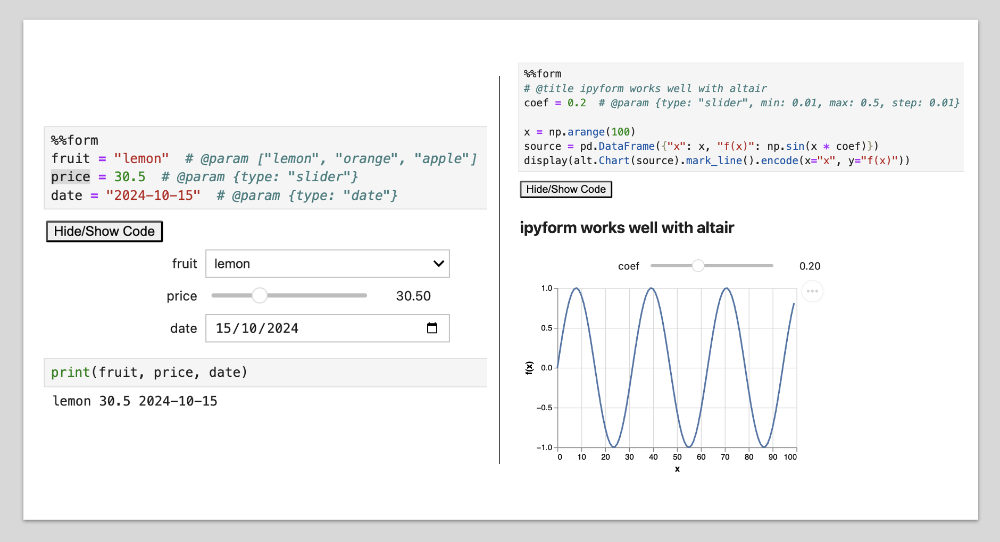

# ipyform

Extension to render [Google Colab Form](https://colab.research.google.com/notebooks/forms.ipynb) on regular Jupyter Notebooks.



```bash
pip install ipyform

# or with uv
uv add ipyform
```

Tested on: Jupyter notebooks, JupyterLab and Vscode.

_The solution has no effect (does nothing) when running on Colab._

## Usage

### Auto detect

Add thoses 2 lines to the top of your notebook. `Ipyform` will detect automatically colab annotations and display widget forms. **No other change is needed**.

```python
%load_ext ipyform
%form_config --auto-detect 1
```

Here is a reproduction of official [Google Colab example](./example/colab_offical.ipynb) example.

### With cell magic

> [!TIP]
> If you use vscode Pylance, use `#! %%form` instead of `%%form`. See [Caveats](#caveats)

<table border="0">
<tr>
<td style="width:50%">

```python
%%form --col 2
# @title This is a form { display-mode: "form" }

# @markdown ### Section 1

number_input = 10.0 # @param {type:"number"}
number_slider = 0 # @param {type:"slider", min:-1, max:1, step:0.1}
integer_input = 10 # @param {type:"integer"}
integer_slider = 1 # @param {type:"slider", min:0, max:100, step:1}

# @markdown ### Section 2

date_input = '2018-03-22' # @param {type:"date"}

```

</td>
<td style="width:50%">


</td>
</tr>
</table>

## Caveats

- `ipyform` uses `ipywidgets` to render the forms. This means that the forms are not rendered in the static version of the notebook.

In `Vscode`

- Hide code feature is not supported.
- Sometimes the `ipywidgets` are duplicated. This is a known issue with ipywidgets and `Vscode`. Reload window will fix.
- Pylance ignores cells with cell magic (`%%form`), and then warms about undefined variables. To avoid the issue, you can use `#! %%form` instead of `%%form`. This way pylance sees the cell as a python cell, and `ipyform` will still render the form.

## Dev

```bash
uv sync
uv run pytest --inline-snapshot=review

# publish
rm -rf dist && uv build
uvx twine upload dist/*
```

## Specs

| When                              | Field Type | Data Types                                              | Default Datatype     | Additional properties    |
| --------------------------------- | ---------- | ------------------------------------------------------- | -------------------- | ------------------------ |
| `@param` followed by options list | Dropdown   | `string`, `raw`                                         | `string`             | `allow-input`, `options` |
| `"type": "slider"`                | Slider     | `number`, `integer`                                     | Determined by `step` | `min`, `max`, `step`     |
| Otherwise                         | Input      | `boolean`, `date`, `string`, `raw`, `number`, `integer` | `raw`                | `placeholder`            |

**Input field**

```python
# datatype: raw
var_name = expression # @param

# datatype: number
var_name = expression # @param {"type": "number", "placeholder": "your number here"}
```

**Dropdown field**

```python
# datatype: string
var_name = expression # @param [1, "2"]

# datatype: raw
var_name = expression # @param ["expression", 1, 2] {"type": "raw"}
```

**Slider field**

```python
# datatype: integer. in range [0, 100]
var_name = expression # @param {"type": "slider"}

# datatype: number
var_name = expression # @param {"type": "slider", "min": 1, "max": 2, "step": 0.1}
```
